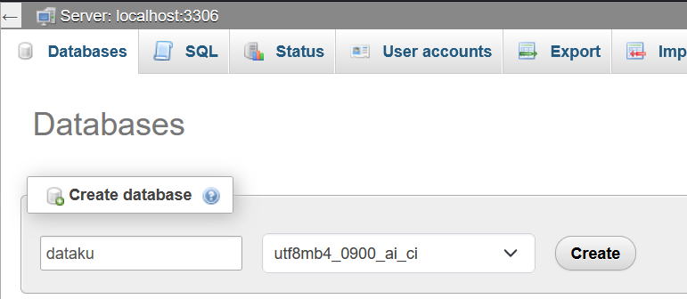
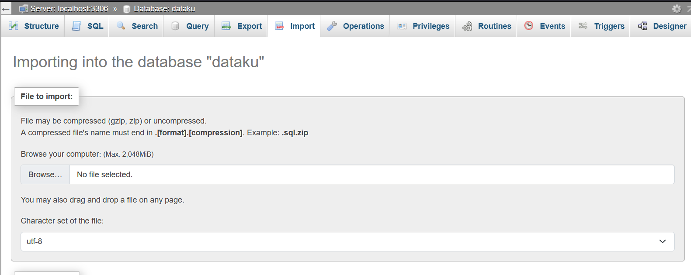
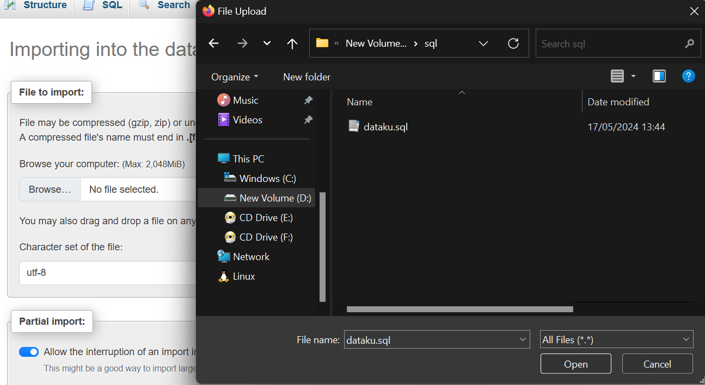
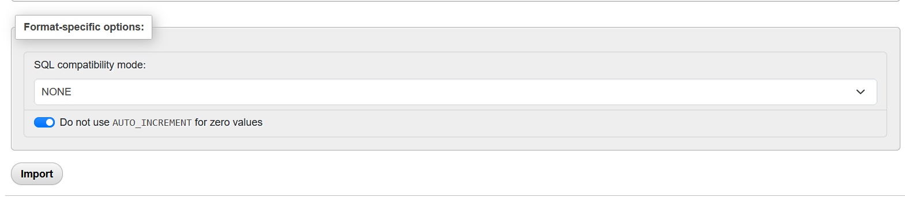
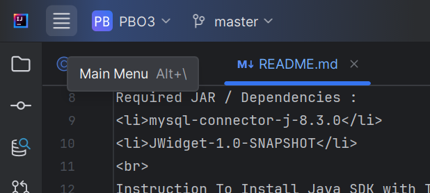
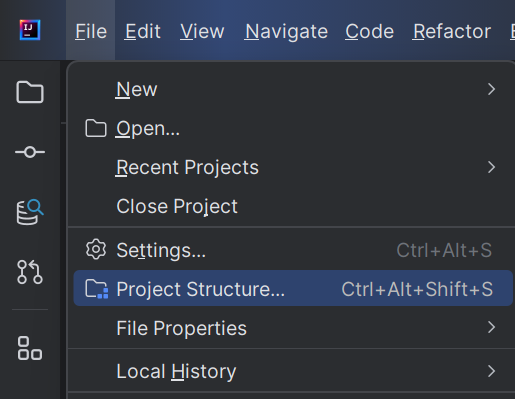
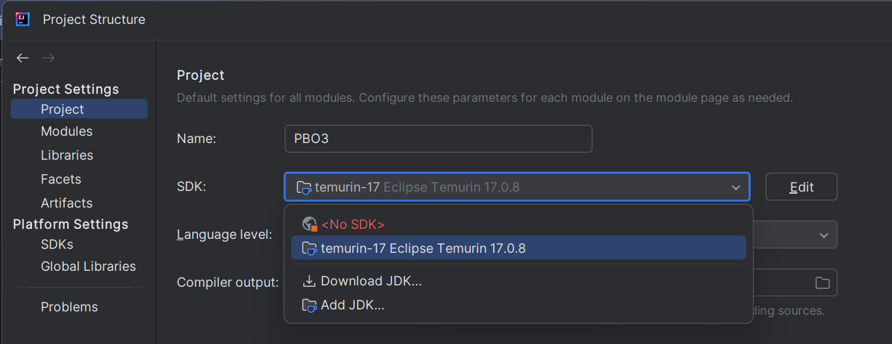
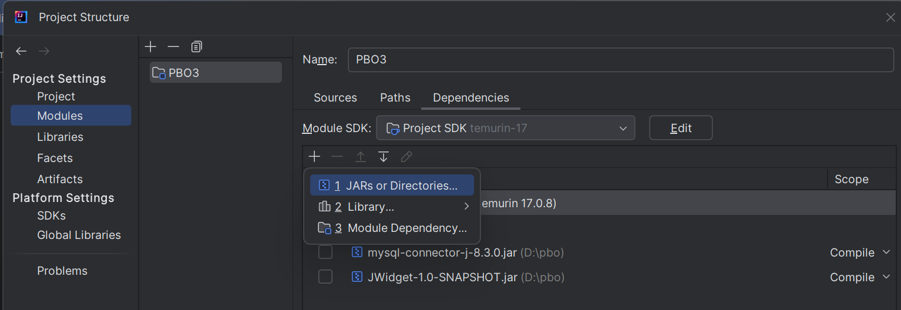

<h1>Github Repo for Data Supplier CRUD with Java</h1>
Software Req :
<li>IDE : IntelliJ Idea</li>
<li>Java SDK 17 (Recommended)</li>
<li>MySQL 8.0.30</li>
 
Required JAR / Dependencies (available in jar folder):
<li>mysql-connector-j-8.3.0.jar</li>

[mysql-connector](jar/mysql-connector-j-8.3.0.jar)
<li>JWidget-1.0-SNAPSHOT.jar</li>

[JWidget](jar/JWidget-1.0-SNAPSHOT.jar)
 

Instruction To Install Java SDK with Temurin Eclipse :
<ol>
<li>

[Download Here](https://adoptium.net/temurin/releases/?version=17)

</li>
<li>Make sure you download the right installer type .msi for your OS</li>
<li>Install</li>
</ol>

Instruction to install the project locally :
<ol>
<li>First run the MySQL services, for the database manager you can use phpMyAdmin</li>
<li>Create the database</li>

<li>Go to the Database and then import sql file

[Download sql file here](database/dataku.sql)
</li>

<li>Make sure the database is correctly imported and then go to the next step</li>
<li>Make sure you have Intellij Idea</li>
<li>Open the IDE</li>
<li>Get from VCS and insert the project repository link</li>
<li>https://github.com/eliz-2chan/PBO3.git</li>
<li>To Resolve the dependencies go to Files > Project Structure > Modules > Dependencies > Add the required JAR Files</li>
<li>To Resolve the JDK requirement go to Files > Project Structure > Project > Choose JDK and go to Modules > Dependencies > Choose your installed Java SDK</li>
<li>Step with Images : </li>

<li>Run Main.java</li>
<li>Here you go!</li>
</ol>
